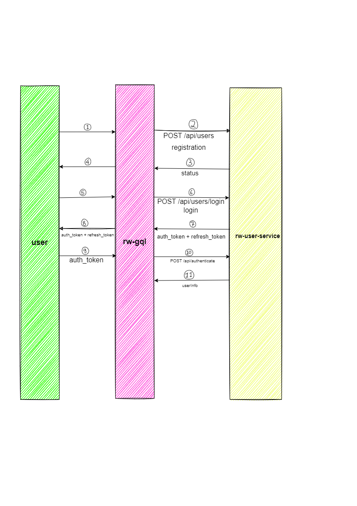

## realworld.io vert.x microservices

#### Services
1. **rw-gql** : Edge layer
2. **rw-user-service** : User Service includes AuthN/AuthZ
3. **rw-article-service** : Article Service
4. **rw-feed-service** : News feed service
5. **rw-notifications** : Notification service
6. **rw-search** : Search service
7. **rw-chat** : Chat service
8. **rw-crons** : Cron service

#### Authentication Flow

